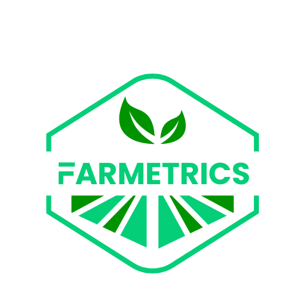

# FARMETRICS

**Smart Agriculture Management Platform for Ghana**

## About Farmetrics

Farmetrics is a comprehensive digital agriculture management platform designed specifically for Ghana's agricultural sector. Our platform revolutionizes farm management through cutting-edge technology, enabling efficient monitoring, data collection, and decision-making across agricultural operations.

## Key Features

### 🌾 **Farm Management**
- Digital farm registration and polygon mapping
- GPS-based boundary tracking
- Crop type and farming practice monitoring
- Real-time farm status updates

### 👥 **Multi-Role Dashboard System**
- **Admin Dashboard**: Complete system oversight and management
- **Supervisor Dashboard**: Regional management and coordination
- **Field Officer Tools**: On-ground data collection and reporting

### 📊 **Data Collection & Analytics**
- Comprehensive visit reporting system
- Geo-tagged image capture
- EXIF data extraction for verification
- Advanced analytics and insights

### 🗺️ **Interactive Mapping**
- Ghana-focused interactive maps
- Farm polygon visualization
- Regional data filtering
- Real-time location tracking

### 📱 **Modern Web Application**
- Responsive design for all devices
- Progressive Web App (PWA) ready
- Offline-capable data collection
- Real-time synchronization

## Technology Stack

- **Frontend**: React.js with TypeScript
- **Backend**: Supabase (PostgreSQL)
- **Maps**: Leaflet.js with OpenStreetMap
- **UI Framework**: Tailwind CSS + shadcn/ui
- **Authentication**: Supabase Auth with Row Level Security

## Target Users

- **Agricultural Administrators**: Government agencies and NGOs
- **Regional Supervisors**: Area managers and coordinators  
- **Field Officers**: On-ground agricultural extension workers
- **Farmers**: Primary beneficiaries of the agricultural programs

## Security & Compliance

- Row Level Security (RLS) for data protection
- Role-based access control
- Secure authentication system
- Data encryption and privacy compliance

## Support & Contact

For more information, technical support, or partnership inquiries:

- **General Inquiries**: info@farmetrics.org
- **Developer Contact**: emanuel@kazinikazi.co.ke

---

**Farmetrics** - *Transforming Agriculture Through Technology*

© 2025 Farmetrics Ghana. All rights reserved.
